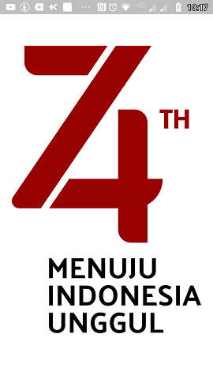
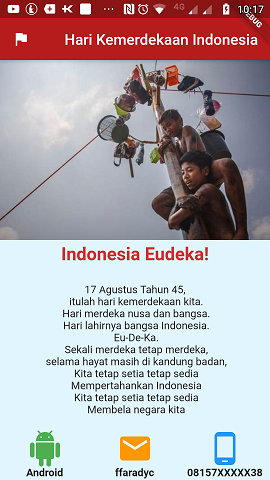
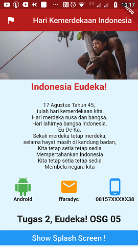

# Hari Kemerdekaan Indonesia - Eudeka

# Flutter *ffaradyc* ( Tugas 2 - OSG05 )
Aplikasi Flutter menampilkan tampilan dengan tema Kemerdekaan Indonesia.

### Screenshot




### Built With
- [Flutter](https://flutter.dev)
- [Visual Studio Code](https://code.visualstudio.com/)

### Created By
- [ffaradyc](https://github.com/ffaradyc)

---

### Desain Tampilan
Tampilan dibagi menjadi 2, yaitu *splash screen* dan *main screen*, digunakan Stateful Widget untuk bisa berpindah dari halaman splash screen ke halaman utama.

### Menambahkan Image di flutter
Untuk menambahkan image agar dapat dibaca oleh flutter, maka pada file __*pubspec.yaml*__ perlu ditambahkan baris assets sebagai berikut, disesuaikan dengan folder asset yang dibuat dan image yang ditempatkan.

```
assets:
    - assets/logo.png
    - assets/panjat.jpg
```

### Pembahasan Code
1. Pembuatan Stateful Widget, untuk berpindah antar tampilan dibutuhkan variabel bertipe boolean __*_isSplash*__, apabila __*_isSplash*__ bernilai **True** maka akan ditampilkan splash screen, begitupun sebaliknya. Untuk dapat mengubah valuenya maka dibutuhkan method yaitu __*_setSplashScreen(bool newValue)*__. Method ini mengubah value isSplash.
```
  class Merdeka extends StatefulWidget {
      Merdeka({Key key}) : super(key: key);

      _MerdekaState createState() => _MerdekaState();
  }
```
```
  class _MerdekaState extends State<Merdeka> {
      bool _isSplash = true;

      // menampilkan Splashscreen saat tampilan pertama
      void _setSplashScreen(bool newValue) {
          setState(() {
          _isSplash = newValue;
          });
      }
      // Widget Aplikasi
  }
```
2. Penggunaan __*_isSplash*__ pada widget untuk memilih tampilan
```
@override
Widget build(BuildContext context) {
  // jika splash screen true maka ditampilkan splash screen
  if (_isSplash) {
      ...
    // return Tampilan Splash Screen
  } else {
      ...
    // Return Tampilan utama
  }
}
```
3. Splash Screen, Pada splash screen tidak menggunakan widget button tapi menggunakan widget **GestureDetector**, yang memiliki child Container berisi Image logo yang berada di folder assets
```
//tampilan splashscreen
return GestureDetector(
    onTap: () {
      // set splashscreen off ( false )
      _setSplashScreen(false);
    },
    // widget Splash Screen
    child: Container(
      color: Colors.white,
      child: Image.asset('assets/logo.png'),
    ),
);
```
4. Main Screen, pada tampilan utama digunakan widget MaterialApp dan scaffold untuk membuat judul pada bagian atas layar. Pada judul dibuat row agar dapat memasukan Icon dan Text.
```
//tampilan utama

return MaterialApp(
  theme: ThemeData(
      primaryColor: Colors.red[900], canvasColor: Colors.lightBlue[50]),
  home: Scaffold(
      // appBar berisi judul aplikasi dan Icon bendera
      appBar: AppBar(
      title: Row(
          crossAxisAlignment: CrossAxisAlignment.center,
          mainAxisAlignment: MainAxisAlignment.spaceBetween,
          children: <Widget>[
              Icon(Icons.flag),
              Text('Hari Kemerdekaan Indonesia'),
          ],
      ),
      ),
      body:
      ...
      //isi body scaffold
  ),
);
```
5. Pada bagian Body digunakan __*SingleChildScrollView*__ agar layar dapat discroll ke bawah
```
//body menggunakan singleChildScrollView agar bisa scroll ke bawah
body: SingleChildScrollView(
child: Column(
  crossAxisAlignment: CrossAxisAlignment.stretch,
  children: <Widget>[
      ...
      //child pertama, Image
      
      ...
      // child ke dua, Menampilkan Title Tengah (posisi dibawah gambar) 
      // dibungkus dengan container agar dapat diset padding

      ...
      // child ke 3 menampilkan text lagu hari kemerdekaan 
      // dibungkus dengan container agar dapat diset paddingnya
      
      ...
      // child ke 4 Menampilkan Kumpulan Icon dibungkus dengan Row agar urutannya 
      // memanjang dan diletakan di posisi tengah dengan widget Center
      
      ...
      // child ke 5 menampilkan tulisan text TUGAS 2

      ...
      // child ke 6 berisi flatbutton yang digunakan untuk berpindah ke halaman splash 
      
  ],
),
),
```
6. Widget Image menampilkan gambar panjat pinang
```
Image.asset('assets/panjat.jpg'),
```
7. Widget Menampilkan Text Title Berwarna Merah di tengah layar
```
Container(
    padding: EdgeInsets.all(5.0),
    child: Text(
        'Indonesia Eudeka!',
        textAlign: TextAlign.center,
        maxLines: 1,
        style: TextStyle(
            color: Colors.red[700],
            fontSize: 24.0,
            fontWeight: FontWeight.bold,
        ),
    ),
),
```
8. Menampilkan teks lagu 17 Agustus
```
Container(
    padding: EdgeInsets.all(20.0),
    child: Text(
    '17 Agustus Tahun 45, \n itulah hari kemerdekaan kita. \n Hari merdeka nusa dan bangsa. \n Hari lahirnya bangsa Indonesia. \n Eu-De-Ka. \n Sekali merdeka tetap merdeka, \n selama hayat masih di kandung badan, \n Kita tetap setia tetap sedia \n Mempertahankan Indonesia \n Kita tetap setia tetap sedia \n Membela negara kita',
    textAlign: TextAlign.center,
    ),
),
```
9. Menampikan kumpulan Icon secara Horizontal, digunakan widget Expanded agar tampilan antar Icon memiliki lebar yang sama
```
Center(
  child: Row(
  mainAxisAlignment: MainAxisAlignment.spaceEvenly,
  children: <Widget>[
      //icon dibungkus Expanded agar mempunyai ukuran yang sama,
      //dan juga dibungkus dengan column agar iconnya mempunyai text di bawahnya
      Expanded(
      child: Column(
          children: <Widget>[
              Icon(Icons.android,
                  color: Colors.green, size: 48.0),
              Text(
                  'Android',
                  style: TextStyle(fontWeight: FontWeight.bold),
              ),
          ],
      ),
      ),
      Expanded(
      child: Column(
          children: <Widget>[
              Icon(Icons.email, color: Colors.orange, size: 48.0),
              Text(
                  'ffaradyc',
                  style: TextStyle(fontWeight: FontWeight.bold),
              ),
          ],
      ),
      ),
      Expanded(
      child: Column(
          children: <Widget>[
              Icon(Icons.phone_android,
                  color: Colors.blue, size: 48.0),
              Text(
                  '08157XXXXX38',
                  style: TextStyle(fontWeight: FontWeight.bold),
              ),
          ],
      ),
      ),
  ],
  ),
),
```
10. Menampikan Widget Text Tugas ke 2 OSG 05
```
Container(
    padding: EdgeInsets.fromLTRB(10, 30, 10, 10),
    child: Text(
    'Tugas 2, Eudeka! OSG 05',
    style:
        TextStyle(fontWeight: FontWeight.bold, fontSize: 24.0),
    textAlign: TextAlign.center,
    ),
),
```
11. Menampilkan Widget FlatButton untuk berpindah ke halaman SplasScreen
```
FlatButton(
    color: Colors.blue,
    textColor: Colors.white,
    disabledColor: Colors.grey,
    disabledTextColor: Colors.black,
    padding: EdgeInsets.all(8.0),
    splashColor: Colors.blueAccent,
    onPressed: () {
        _setSplashScreen(true);
    },
    child: Text('Show Splash Screen !',
        style: TextStyle(fontSize: 20.0),
    ),
),
```
### Full Code
```
import 'package:flutter/material.dart';

void main() => runApp(Merdeka());


// Stateful Widget untuk membuat tampilan dinamis antara tampilan splash dan tampilan utama
class Merdeka extends StatefulWidget {
  Merdeka({Key key}) : super(key: key);

  _MerdekaState createState() => _MerdekaState();
}

class _MerdekaState extends State<Merdeka> {
  bool _isSplash = true;

  //menampilkan Splashscreen saat tampilan pertama
  void _setSplashScreen(bool newValue) {
    setState(() {
      _isSplash = newValue;
    });
  }

  @override
  Widget build(BuildContext context) {
    // jika splash screen true maka ditampilkan splash screen
    if (_isSplash) {
      return GestureDetector(
        onTap: () {
          // set splashscreen off ( false )
          _setSplashScreen(false);
        },
        // widget Splash Screen
        child: Container(
          color: Colors.white,
          child: Image.asset('assets/logo.png'),
        ),
      );
    } else {
      // Tampilan utama
      return MaterialApp(
        theme: ThemeData(
            primaryColor: Colors.red[900], canvasColor: Colors.lightBlue[50]),
        home: Scaffold(
          // appBar berisi judul aplikasi dan Icon bendera
          appBar: AppBar(
            title: Row(
              crossAxisAlignment: CrossAxisAlignment.center,
              mainAxisAlignment: MainAxisAlignment.spaceBetween,
              children: <Widget>[
                Icon(Icons.flag),
                Text('Hari Kemerdekaan Indonesia'),
              ],
            ),
          ),
          //body menggunakan singleChildScrollView agar bisa scroll ke bawah
          body: SingleChildScrollView(
            child: Column(
              crossAxisAlignment: CrossAxisAlignment.stretch,
              children: <Widget>[
                //child pertama, Image
                Image.asset('assets/panjat.jpg'),
                // child ke dua, Menampilkan Title Tengah (posisi dibawah gambar) 
                // dibungkus dengan container agar dapat diset padding
                Container(
                  padding: EdgeInsets.all(5.0),
                  child: Text(
                    'Indonesia Eudeka!',
                    textAlign: TextAlign.center,
                    maxLines: 1,
                    style: TextStyle(
                      color: Colors.red[700],
                      fontSize: 24.0,
                      fontWeight: FontWeight.bold,
                    ),
                  ),
                ),
                // child ke 3 menampilkan text lagu hari kemerdekaan 
                // dibungkus dengan container agar dapat diset paddingnya
                Container(
                  padding: EdgeInsets.all(20.0),
                  child: Text(
                    '17 Agustus Tahun 45, \n itulah hari kemerdekaan kita. \n Hari merdeka nusa dan bangsa. \n Hari lahirnya bangsa Indonesia. \n Eu-De-Ka. \n Sekali merdeka tetap merdeka, \n selama hayat masih di kandung badan, \n Kita tetap setia tetap sedia \n Mempertahankan Indonesia \n Kita tetap setia tetap sedia \n Membela negara kita',
                    textAlign: TextAlign.center,
                  ),
                ),
                // child ke 4 Menampilkan Kumpulan Icon dibungkus dengan Row agar urutannya 
                // memanjang dan diletakan di posisi tengah dengan widget Center
                Center(
                  child: Row(
                    mainAxisAlignment: MainAxisAlignment.spaceEvenly,
                    children: <Widget>[
                      //icon dibungkus Expanded agar mempunyai ukuran yang sama,
                      //dan juga dibungkus dengan column agar iconnya mempunyai text di bawahnya
                      Expanded(
                        child: Column(
                          children: <Widget>[
                            Icon(Icons.android,
                                color: Colors.green, size: 48.0),
                            Text(
                              'Android',
                              style: TextStyle(fontWeight: FontWeight.bold),
                            ),
                          ],
                        ),
                      ),
                      Expanded(
                        child: Column(
                          children: <Widget>[
                            Icon(Icons.email, color: Colors.orange, size: 48.0),
                            Text(
                              'ffaradyc',
                              style: TextStyle(fontWeight: FontWeight.bold),
                            ),
                          ],
                        ),
                      ),
                      Expanded(
                        child: Column(
                          children: <Widget>[
                            Icon(Icons.phone_android,
                                color: Colors.blue, size: 48.0),
                            Text(
                              '08157XXXXX38',
                              style: TextStyle(fontWeight: FontWeight.bold),
                            ),
                          ],
                        ),
                      ),
                    ],
                  ),
                ),

                // child ke 5 menampilkan tulisan text TUGAS 2
                Container(
                  padding: EdgeInsets.fromLTRB(10, 30, 10, 10),
                  child: Text(
                    'Tugas 2, Eudeka! OSG 05',
                    style:
                        TextStyle(fontWeight: FontWeight.bold, fontSize: 24.0),
                    textAlign: TextAlign.center,
                  ),
                ),

                // child ke 6 berisi flatbutton yang digunakan untuk berpindah ke halaman splash 
                FlatButton(
                  color: Colors.blue,
                  textColor: Colors.white,
                  disabledColor: Colors.grey,
                  disabledTextColor: Colors.black,
                  padding: EdgeInsets.all(8.0),
                  splashColor: Colors.blueAccent,
                  onPressed: () {
                    _setSplashScreen(true);
                  },
                  child: Text('Show Splash Screen !',
                      style: TextStyle(fontSize: 20.0)),
                ),
              ],
            ),
          ),
        ),
      );
    }
  }
}

```

## Terimakasih :smile:

### Info Lebih Lengkap
Website : [www.eudeka.id](https://www.eudeka.id)  
Twitter: [@EudekaID](https://twitter.com/EudekaID)  
Telegram : [@eudekainfo](https://t.me/eudekainfo)  
Instagram : [@eudeka.id](https://instagram.com/eudeka.id)  
WhatsApp : [0895351577557](https://wa.me/62895351577557)  
Email : [info@eudeka.id](mailto:info@eudeka.id)  

---

###### tags: `Flutter` `Eudeka` `OSG05`